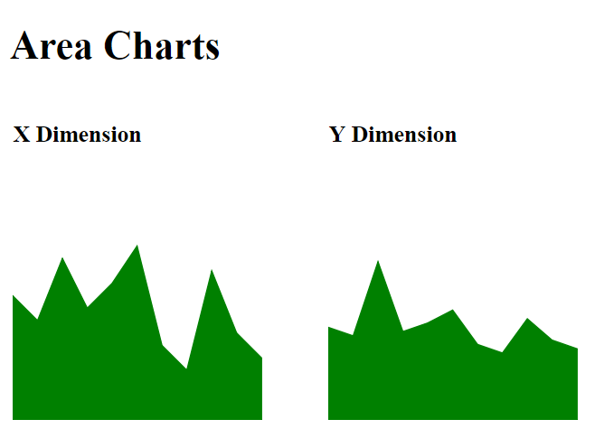

# datavis-coursework

## hw6

I am going to visualize the election outcomes and the contribution of different states over multiple years. You will be able to see the outcomes for the Democratic and Republican parties, as well as for the rare independent winner (independents are rare though, as they have to win a state to show up in our visualization). 

The final visualization looks like this (tooltip and brush are displayed to show interaction): 

This has been done using three charts:

- The **year chart** allows you to visualize different election years where you can select a specific year to explore.
- The **electoral vote chart** visualizes the wining party and the number of electoral votes corresponding to each state
- The **vote percentage chart** displays the percentage of votes won by each party and independent candidates in some cases.

The **tile chart** visualizes the same data as the electoral vote chart, but provides geospatial context. In addition, this will also display the distribution of votes within a state. 

The **shift chart** (extra credit) visualizes the percentage shift in the outcome of selected states over the years. For instance, you will be visualizing information such as: 'Ohio' has seen a shift of 11% towards Republican in the year 1980". 

The year chart will be your pivot for interaction as it controls the information being displayed by the electoral vote chart, the vote percentage chart and the tile chart. Also, brushing on your electoral chart should filter the information being displayed by the shift chart.

----
## hw5

In this assignment, I explored game statistics from the last Fifa World Cup in 2014. To this end, I have created an interactive table and a tree layout that are linked to each other.

The final visualization looks like this: 

In the **table** I will compare the following attributes for each participating country: goals made and conceded, number of games lost, won, and played, and the result achieved (i.e., how far a team got before exiting) in the tournament. 
I also visualized results for specific matches by allowing the user to expand and collapse all matches for a selected country (6630 only). 

In addition, I have displayed the bracket for the second stage (the knockout phase) of the tournament in a **tree**. The tree and table are linked so that hovering over a team in the table highlights all the tree nodes and links for that team. Hovering over a specific match highlights only that game. 

----
## hw4

In this assignment, I created a bar chart, a map, and an info panel that are linked to each other and display statistics from Fifa World Cup Games dating back to 1930. We've retrieved the data from [FIFA's website](http://www.fifa.com/fifa-tournaments/statistics-and-records/worldcup/).

The final visualization looks like the figure below: 

I have compared several attributes (such as attendance, number of teams, number of goals) of every World Cup since 1930. I also visualizes all the information for specific years using the map and info panel. 

- The **bar chart** allows us to see the evolution of attendance, total number of goals, the number of games, and the number of participating countries over the years. 
- The **world map** highlights the host country, all participating  countries, as well as the gold and silver medal winners. 
- The **info panel** displays host, winner and runner-up, and show a list of all participants.

The bar chart will act as our way to select a particular world cup: by clicking the bar associated with the year, the map and the info box will display the data associated with that world cup. 

----
## hw3

In this assignment, I made the charts developed for Homework 1 interactive with JavaScript and D3.

----

## hw2

In this assignment, I used JavaScript to create a tree data structure, and then rendered that tree on the browser with the D3 library.

----
## hw1

In this assignment, I created a simple webpage with some graphical content using HTML, CSS, and SVG.

